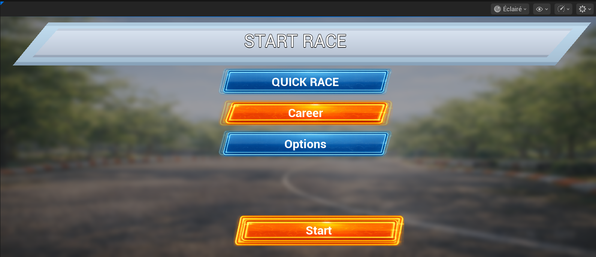
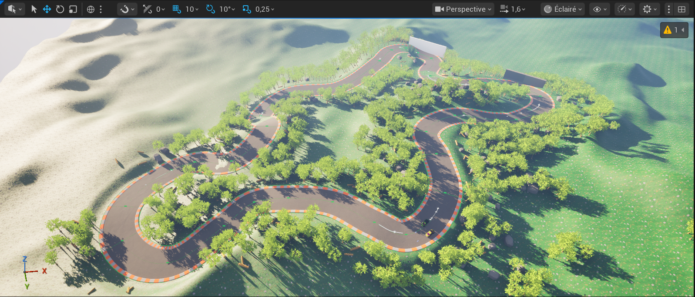
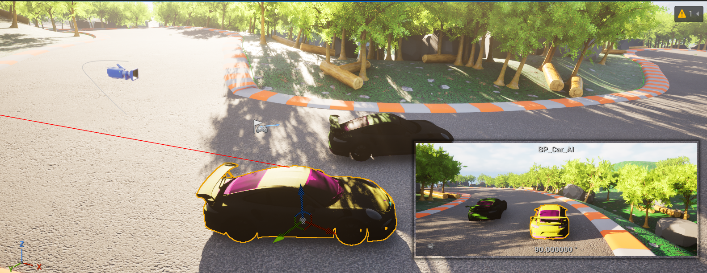
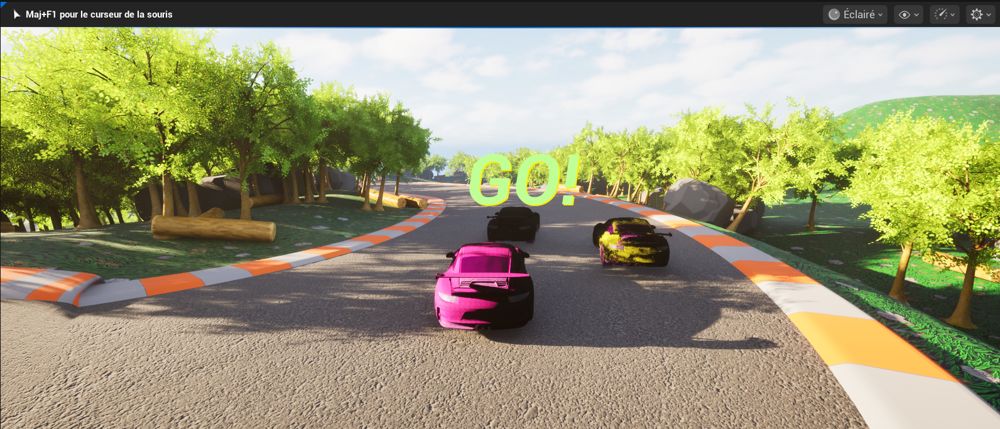

# 🏎️ RacingGame – Unreal Engine 5

RacingGame est un jeu de course 3D prototype développé avec Unreal Engine 5 en utilisant Blueprints.
Le projet met en place un système de véhicule jouable, une interface de menu, un compte à rebours avant la course, des voitures IA, ainsi que des effets visuels dynamiques (skid marks et fumée) basés sur la physique du véhicule.

---

## 🎮 Fonctionnalités actuelles

🚗 Voiture jouable basée sur Chaos Vehicle System
🤖 Voitures IA suivant la piste via Spline
🧭 Menu principal + bouton Start
⏱️ Système de countdown avant le départ de la course
🛞 Skid marks dynamiques (selon vitesse et frein à main)
💨 Effets de fumée lors du dérapage
📷 Caméra avec Spring Arm
🎮 Contrôles clavier
⚙️ Projet réalisé 100% en Blueprints (sans C++)

---

## 🛠️ Technologies utilisées

Unreal Engine 5
Blueprints
Chaos Vehicle System
Niagara (Skid Marks & Smoke)
UMG (UI : Menu, Countdown)
Materials & Material Instances
Spline System (IA)

---

## 🎮 Contrôles

| Action | Touche |
|------|------|
| Accélérer | W |
| Freiner | S |
| Tourner | A / D |
| Frein à main | Space |
| Caméra | Souris |

---

## 📸 Screenshots

---

## 🧠 Détails techniques

Les voitures IA utilisent une Spline pour suivre la piste
Le countdown est géré via un Widget UMG avec animation
Les skid marks et la fumée sont activés dynamiquement selon :
la vitesse du véhicule
l’utilisation du frein à main
Utilisation de Niagara Systems attachés aux roues
Paramètres visuels contrôlés via Material Instances
Logique de gameplay, UI et véhicule implémentée en Blueprints

---

## 🚀 État du projet

✅ Prototype jouable

🚧 En cours d’amélioration (polish, UI, gameplay, level design)

## 👤 Auteur

**Hadil Rahal**  
Étudiant en programmation jeux vidéo – Unreal Engine  
