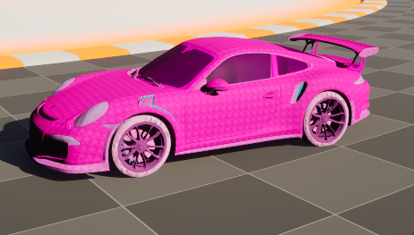
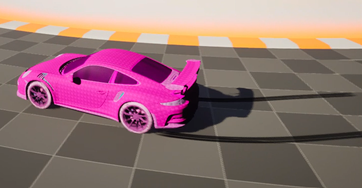
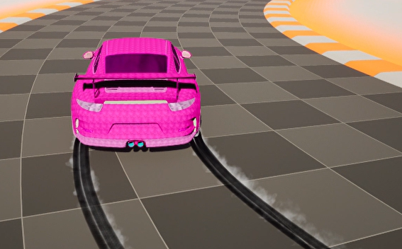

# 🏎️ RacingGame – Unreal Engine 5

RacingGame est un projet de jeu de course développé avec **Unreal Engine 5**.  
Le projet met en place une **voiture entièrement contrôlable**, avec des effets visuels dynamiques comme les **skid marks** et la **fumée**, basés sur la physique du véhicule.

---

## 🎮 Fonctionnalités actuelles

- 🚗 Voiture drivable (Chaos Vehicle)
- 🕹️ Contrôles clavier/souris
- 🛞 Skid marks dynamiques (activation selon la vitesse et le frein à main)
- 💨 Effets de fumée lors du dérapage
- 📷 Caméra avec Spring Arm (rotation souris)
- ⚙️ Blueprints uniquement (aucun C++)

---

## 🛠️ Technologies utilisées

- Unreal Engine 5
- Blueprints
- Chaos Vehicle System
- Niagara (SkidMarks & Smoke)
- Materials & Material Instances

---

## 🎮 Contrôles

| Action | Touche |
|------|------|
| Accélérer | W |
| Freiner | S |
| Tourner | A / D |
| Frein à main | Space |
| Caméra | Souris |

---

## 📸 Screenshots

---

## 🧠 Détails techniques

- Les **skid marks** et la **fumée** sont activés dynamiquement en fonction :
  - de la vitesse du véhicule
  - de l’activation du frein à main
- Utilisation de **Niagara Systems** attachés aux roues arrière
- Opacité et intensité contrôlées via **Material Instances**

---

## 🚧 Prochaines étapes

- Ajout de voitures IA
- Création du landscape et de la piste
- Amélioration des effets visuels
- UI (compteur de vitesse, HUD)

---

## 👤 Auteur

**Hadil Rahal**  
Étudiant en programmation jeux vidéo – Unreal Engine  
